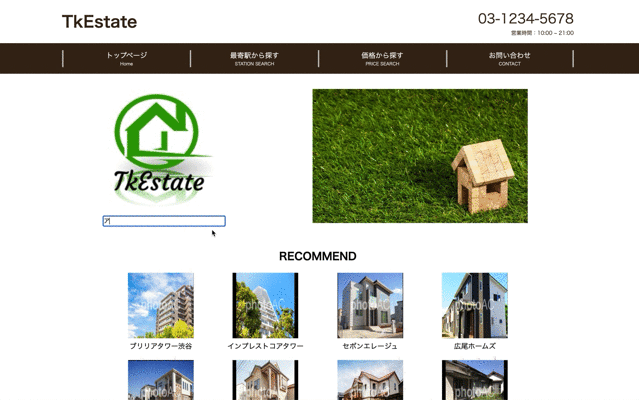
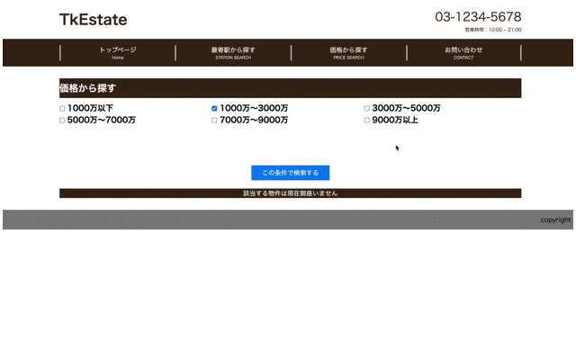
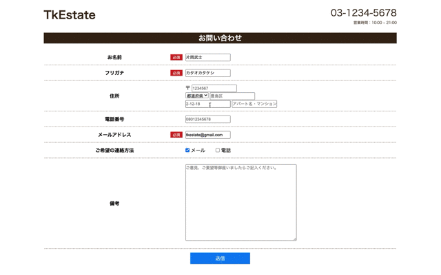

# 不動産物件検索アプリ
東京都の中古マンション売買専門の不動産業者さんを想定してこのアプリを作成しました。
お客様が不動産業者さんに**気軽に足を運んでいただくキッカケになるように**という想いを込めて作成しました。

下記、概要等を記載いたします。
# リンク
http://54.95.213.76/tkestate

# このアプリでできること
## キーワードで物件検索

  - 物件名のキーワードから物件検索できます。

## 最寄駅からの物件検索

  - ご希望の駅近くの物件を検索できます。

## 価格帯からの物件検索

  - ご希望の価格帯から物件検索できます。
  
## 物件詳細

  - 物件の外観、内装、間取り等をご覧いただけます。

## 内見の要望等のお問い合わせ

  - 内見のご要望やその他ご相談を受け付けるフォームを作成しました。

# 工夫したポイント
  - お問い合わせの都道府県の欄にenumを使用し、日本語表記できるようにしました。
  - 物件詳細ページのサムネイル画像とメイン画像をJSを活用して、切り替え可能にしました。
  - お客様になるべくストレスをかけないようにバリデーションは名前とメール欄だけにしました。

# 開発環境/使用技術一覧
  - PHP
  - Laravel
  - MySQL
  - Nginx
  - Docker
  - AWS
  - Github
  - Atom
  - テスト(PHPunit)
  - JS
